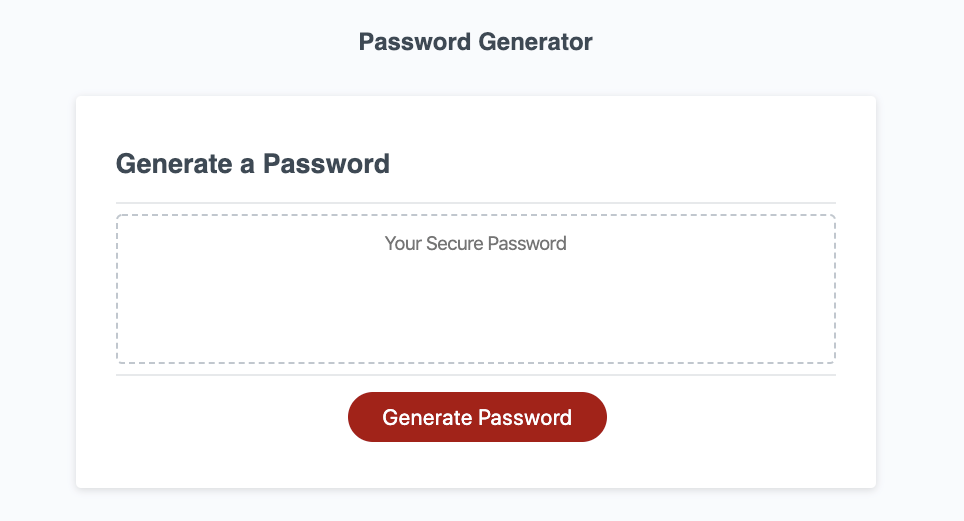
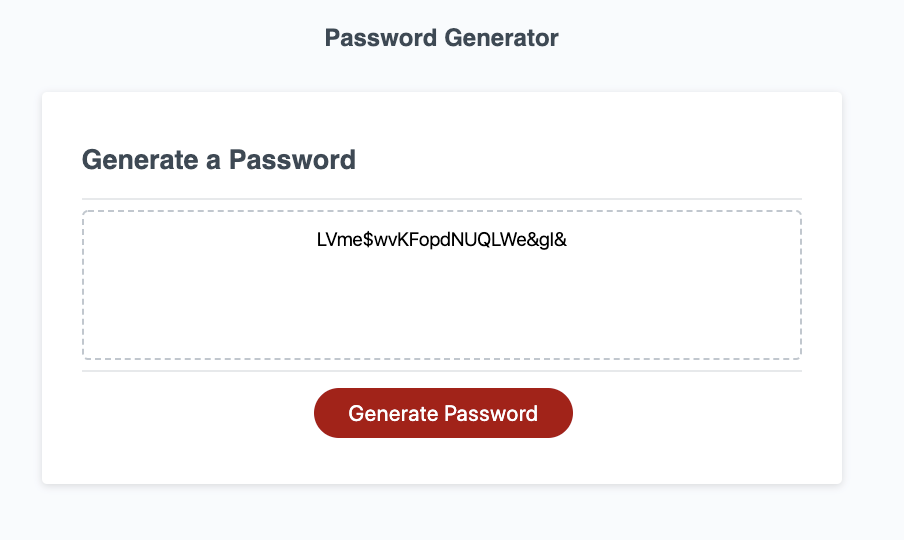

# Password-Generator

1) Goals and Methods
- Using Javascript, I have created a password generator that provides the user a secure password everytime! Upon load of the page, the user will be prompted with questions to determine password length, special characters, numbers, upper case letters and lower case letters. This allows the user to customize their password selection. Enjoy!

2) Technologies
- HTML
- CSS
- Javascript

Javascript Changes: 
1) Wrote function generatePassword
2) Inside that function: 
- Defined Variables and arrays
- Created for loop to prompt for Password length
- Created four for loops for confirm questions
- Pushed the individual arrays into the combined array if the user said yes.
- Generated a random number based on 0 to array length and selected the password possibility that corresponds to that number
- Returned result without commas using join method for display

3) Installation: 
- None required

Link to website: https://ksmera01.github.io/Homework-3/

